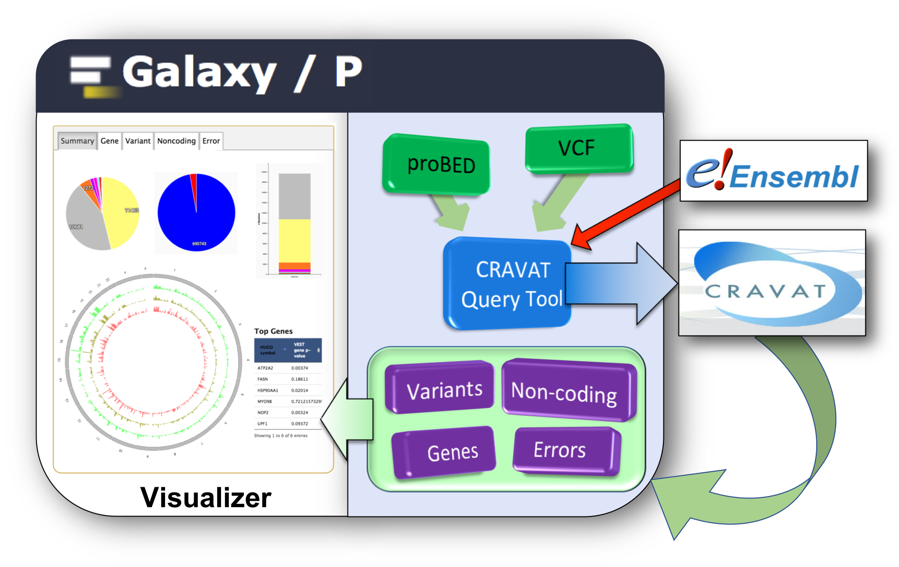
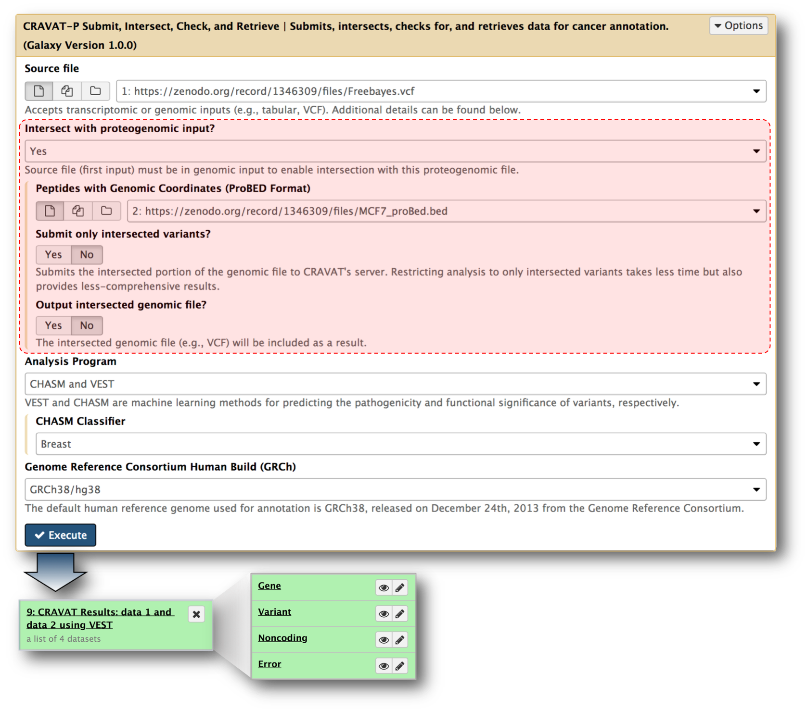
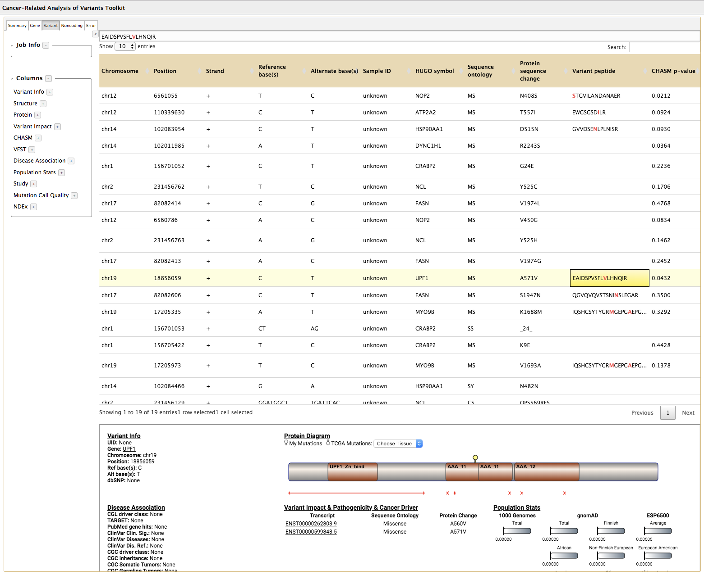

# CRAVAT-P Galaxy Docker

A Docker image containing a fully-operational Galaxy instance with pre-installed demonstration material for CRAVAT-P.

<a href="#cravat-p-tutorial"></a>

### What's included:
- Galaxy Instance (version 17.09)
- CRAVAT-P submit, intersect, annotate, and retrieve Galaxy tool
- CRAVAT-P Galaxy Viewer
- Input files (i.e., VCF and proBED files)
- Basic CRAVAT-P Workflow

---

### Table of Contents:
- [Background](#background-)
  * [CRAVAT-P](#cravat-p-)
  * [Galaxy](#galaxy-)
  * [CRAVAT-P Galaxy tool](#galaxy-tool-)
  * [CRAVAT-P Galaxy viewer plugin](#installation-guide-)
- [Installation Guide](#installation-guide-)
- [CRAVAT-P Tutorial](#cravat-p-tutorial-)
  * [1.) Import the input files](#1-import-the-input-files-from-the-data-library-)
  * [2.) Run the workflow](#2-log-in-and-run-the-workflow-)
  * [3.) Access the viewer](#3-access-the-viewer-)
- [Clean-up Guide](#installation-guide-)

---

# Background [⤴](#table-of-contents)
### CRAVAT-P [⤴](#table-of-contents)
(<b>C</b>ancer <b>R</b>elated <b>A</b>nalysis of <b>VA</b>riants <b>T</b>oolkit - <b>P</b>roteomics)

CRAVAT-P is a proteomic extension of CRAVAT (http://cravat.us) developed for the Galaxy-P (http://galaxyp.org) bioinformatics platform. CRAVAT-P exists as a downstream analysis suite for peptide variants. Current support is tailored towards workflows that generate peptide sequences mapped to genomic locations. 

s


### Galaxy Tool [⤴](#table-of-contents)
The accepted format for this proteogenomic input is the proBED format. Alongside a genomic input file—VCF (Variant Call Format)—a simple Python script performs an intersection to determine which genomic variants have associated peptide variants. These variant matches are then verified via protein sequences from Ensembl. Once matched, these peptides are included within the tabular output provided by the CRAVAT server.



### Galaxy Viewer Plugin [⤴](#table-of-contents)



</br>

# Installation Guide [⤴](#table-of-contents)
1.) Install Docker for  [Mac](https://docs.docker.com/docker-for-mac/install/) or [PC](https://docs.docker.com/docker-for-windows/install/). Open Docker.

2.) Open your terminal. Run the following command:
```sh
docker run -d -p 8080:80 jraysajulga/galaxy-cravatp-docker
```
*For your information:* [Docker Command Line Interface](https://docs.docker.com/engine/reference/commandline/docker/)
```
docker run [OPTIONS] IMAGE [COMMAND]
```
| Element                           | Description                                                     | Type         |
| --------------------------------- | --------------------------------------------------------------- | -----------  |
| docker                            | The base command for the Docker CLI (Command Language Interface)| Base command |
| run                               | Run a command in a new container                                | Command      |
| -d, --detach                      | Run container in background and print container ID              | OPTION       |
| -p, --publish                     | Publish a container's port(s) to the host                       | OPTION       |
| jraysajulga/galaxy-cravatp-docker | **jraysajulga's** *galaxy-cravatp-docker* image                 | IMAGE        |


3.) Wait a few moments for the Docker image to initialize. 
Open **http://localhost:8080** and follow the next guide to access the CRAVAT-P suite.

</br>

# CRAVAT-P Tutorial [⤴](#table-of-contents)

</br>
<p align="center"> <b>Overview</b> </p>
<p align="center"> Import the input files → Run the workflow →  Access the viewer</p>
</br>

## 1.) **Import the input files** from the data library [⤴](#table-of-contents)

|_____________________________________________________________|_____________________________________________________________|
| ----------------------------------------------------------- | ----------------------------------------------------------- |
| <ul><li>click **Shared Data** > **Data Libraries**</li><li>open **Training Data** > **Input files for CRAVAT-P Demo**</li><li>check the checkbox in the header to select both input files</li><li>click **to History**</li><li>*optional: name your new history (e.g., mcf7_cancer_proteogenomics)*</li><li>click import</li><li>click on the green pop-up window to go back to the homepage to analyze these datasets.</li></ul>| <a target="_blank" href="http://localhost:8080"></a> |


## 2.) Log in and **run the workflow** [⤴](#table-of-contents)

|_____________________________________________________________|_____________________________________________________________|
| ----------------------------------------------------------- | ----------------------------------------------------------- |
| <ul><li>The CRAVAT-P workflow was placed into an administrative account through Docker. To access it, click **Login or Register** > **Login** and log in using the following credentials:</li><ul><li>**Username:** admin@galaxy.org</li><li>**Password:** admin</li></ul><li>click **Workflow** to show the list of workflows in this account. *In this case, we only have the **CRAVAT Workflow***</li><li>click on the **CRAVAT Workflow** button and click **Run** from the resulting dropdown</li><li>click **Run workflow**. The  analysis will start and will finish in a couple of minutes. *This workflow was set to include proteogenomic input and automatically select the correct input file types (VCF and proBED) in the history.*</li></ul>| <a href="http://localhost:8080"></a> |

## 3.) **Access the viewer** [⤴](#table-of-contents)

|_____________________________________________________________|_____________________________________________________________|
| ----------------------------------------------------------- | ----------------------------------------------------------- |
| <ul><li>*Once the VCF output turns green (signifying completion), you can access the visualizer.* Open the dataset collection, and click on any of the four datasets to expand it. The **variant** dataset is preferred, since it typically contains the most useful information. *In the viewer, you will be able to access all the datasets anyway.*</li><li>Click the "visualize" icon and select **CRAVAT Viewer**.</li></ul>| <a href="http://localhost:8080"></a> |

---

