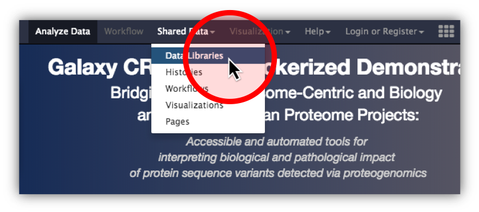
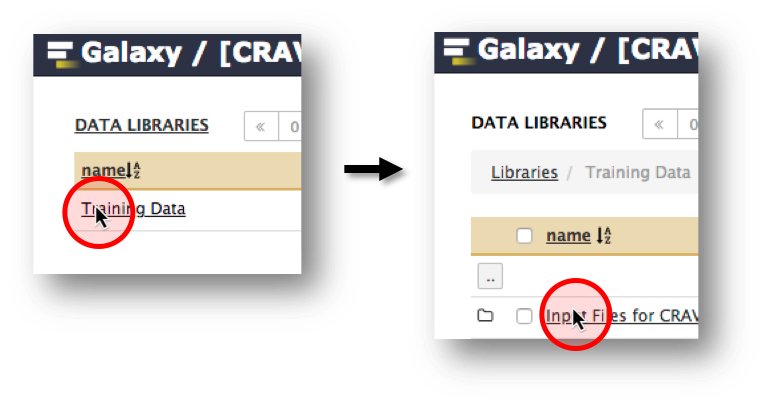

# CRAVAT-P Galaxy Docker

##### Description:
A docker flavor extended from the Galaxy docker image to include the CRAVAT-P demonstration material.


##### What's included:
- CRAVAT-P submit, intersect, annotate, and retrieve Galaxy tool
- CRAVAT Galaxy Viewer
- Input files (i.e., VCF and proBED files)
- Basic CRAVAT Workflow
---
# Docker Guide
1.) Install Docker for  [Mac](https://docs.docker.com/docker-for-mac/install/) or [PC](https://docs.docker.com/docker-for-windows/install/). Open Docker.

2.) Open your terminal. Run the following command:
```sh
docker run -d -p 8080:80 jraysajulga/galaxy-cravatp-docker
```
*For your information:* [Docker Command Line Interface](https://docs.docker.com/engine/reference/commandline/docker/)
```
docker run [OPTIONS] IMAGE [COMMAND]
```
| Element                           | Description                                                     | Type         |
| --------------------------------- | --------------------------------------------------------------- | -----------  |
| docker                            | The base command for the Docker CLI (Command Language Interface)| Base command |
| run                               | Run a command in a new container                                | Command      |
| -d, --detach                      | Run container in background and print container ID              | OPTION       |
| -p, --publish                     | Publish a container's port(s) to the host                       | OPTION       |
| jraysajulga/galaxy-cravatp-docker | **jraysajulga's** *galaxy-cravatp-docker* image                 | IMAGE        |


3.) Wait a few moments for the Docker image to initialize. 
Open **http://localhost:8080** and follow the next guide to access the CRAVAT-P suite.


---
# CRAVAT-P in Galaxy Guide

|                       | **Overview**         |                   |
|:------------------------:|:------------------:|:----------------:|
| Import the input files → | Run the workflow → | Access the viewer |
|                          |                    |                       |

#### 1.) **Import the input files** from the data library

| | |
| ------------------------ | ------------------ |
| click **Shared Data** > **Data Libraries** <ul><li>open **Training Data** > **Input files for CRAVAT-P Demo**</li><li>check the checkbox in the header to select both input files</li><li>click **to History**</li><li>*optional: name your new history (e.g., mcf7_cancer_proteogenomics)* click import</li><li>click on the green pop-up window to go back to the homepage to analyze these datasets.</li></ul>|  
|  |  |

 #### 2.) Log in and **run the workflow**
* The CRAVAT-P workflow was placed into an administrative account through Docker. To access it, click **Login or Register** > **Login** and log in using the following credentials:

| | | 
| ------------------------ | ------------------ |
|  **Username:**              | admin@galaxy.org |
| **Password:**  | admin |
| | | 

* click **Workflow** to show the list of workflows in this account. *In this case, we only have the **CRAVAT Workflow***,
* click on the **CRAVAT Workflow** button and click **Run** from the resulting dropdown,
* click **Run workflow**. The  analysis will start and be completed in a couple of minutes. *This workflow was set to include proteogenomic input and automatically select the correct input file types (VCF and proBED) in the history.*

#### 2.) **Access the viewer**
* Once the VCF output turns green (signifying completion), you can access the visualizer.
* Open the dataset collection, and click on any of the four datasets to expand it. The **variant** dataset is preferred, since it typically contains the most useful information. *In the viewer, you will be able to access all the datasets anyway.*
* Click the "visualize" icon and select **CRAVAT Viewer**.
---


