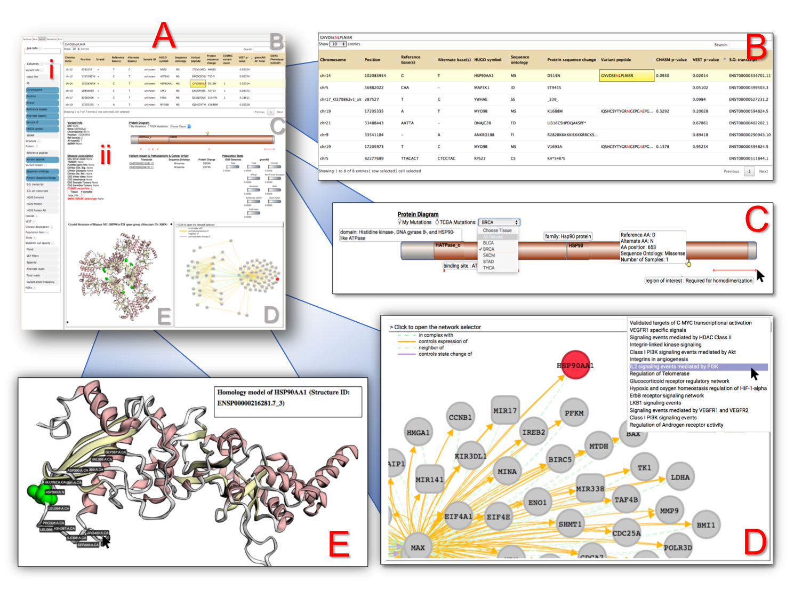

# CRAVAT-P Galaxy Docker

A Docker image containing a fully-operational Galaxy instance with pre-installed demonstration material for CRAVAT-P.

<a href="#cravat-p-tutorial"></a>

*Created as a demonstration for the following technical note for the Journal of Proteome Research*:

> [**Bridging the Chromosome-Centric and Biology and Disease Human Proteome Projects: Accessible and automated tools for interpreting biological and pathological impact of protein sequence variants detected via proteogenomics**](https://pubs.acs.org/doi/10.1021/acs.jproteome.8b00404)  Ray Sajulga, Subina Mehta, Praveen Kumar, James E. Johnson, Candace R. Guerrero, Michael C. Ryan, Rachel Karchin, Pratik D. Jagtap, and Timothy J. Griffin

### What's included:
- <a target="_blank" href="https://github.com/galaxyproject/galaxy/tree/release_17.09">Galaxy Instance (version 17.09)</a>
- <a target="_blank" href="https://github.com/jraysajulga/cravatp_score_and_annotate">CRAVAT-P submit, intersect, annotate, and retrieve Galaxy tool</a>
- <a target="_blank" href="https://github.com/jraysajulga/CRAVAT-Galaxy-Visualizer">CRAVAT-P Galaxy Viewer</a>
- Input files (i.e., VCF and proBED files)
- Basic CRAVAT-P Workflow

---

### Table of Contents:
- [**Installation Guide**](#installation-guide-)
- [*Background*](#background-)
  * [*CRAVAT-P*](#cravat-p-)
  * [*Galaxy tool*](#galaxy-tool-)
  * [*Galaxy workflow*](#galaxy-workflow-)
  * [*Galaxy viewer plugin*](#installation-guide-)
- [**CRAVAT-P Tutorial**](#cravat-p-tutorial-)
  * [1.) Import the input files](#1-import-the-input-files-from-the-data-library-)
  * [2.) Run the workflow](#2-log-in-and-run-the-workflow-)
  * [3.) Access the viewer](#3-access-the-viewer-)
- [**Viewer Features**](#viewer-features-)

---


# Installation Guide [⤴](#table-of-contents)
1.) Install Docker for  [Mac](https://docs.docker.com/docker-for-mac/install/) or [PC](https://docs.docker.com/docker-for-windows/install/). Open Docker.

2.) Open your terminal. Run the following command:
```sh
docker run -d -p 8080:80 jraysajulga/galaxy-cravatp-docker
```
The image will now download from the public repository [*jraysajulga/galaxy-cravatp-docker*](https://hub.docker.com/r/jraysajulga/galaxy-cravatp-docker/) on Docker Hub. This should take around 15 minutes to download.

> In the meanwhile, feel free to take some time to understand the different components of this Docker command. You can also read up on background information in the next [section](#background-).

| Component                         | Type         | Description                                                     |
| --------------------------------- | -----------  | --------------------------------------------------------------- |
| docker                            | Base command | The base command for the Docker CLI (Command Language Interface)|
| run                               | Command      | Run a command in a new container                                |
| -d, --detach                      | OPTION       | Run container in background and print container ID              |
| -p, --publish                     | OPTION       | Publish a container's port(s) to the host                       |
| jraysajulga/galaxy-cravatp-docker | IMAGE        | **jraysajulga's** *galaxy-cravatp-docker* image                 |

*More documentation can be found at [Docker's documentation website](https://docs.docker.com/engine/reference/commandline/docker/)*.

3.) Wait a few moments for the Docker image to initialize as a container.
Open **http://localhost:8080** and follow the next guide to access the CRAVAT-P suite. *If you do not see the Galaxy screen, wait a few moments and then reload the page*.

**Once you are finished using this container, you can clean up your workspace by simply exiting out of Docker.**
</br>

---

# Background [⤴](#table-of-contents)

### CRAVAT-P [⤴](#table-of-contents)
(<b>C</b>ancer <b>R</b>elated <b>A</b>nalysis of <b>VA</b>riants <b>T</b>oolkit - <b>P</b>roteomics)

CRAVAT-P is a proteomic extension of CRAVAT (http://cravat.us) developed for the Galaxy-P (http://galaxyp.org) bioinformatics platform. CRAVAT-P exists as a downstream analysis suite for peptide variants. Current support is tailored towards workflows that generate peptide sequences mapped to genomic locations. 

### Galaxy Tool [⤴](#table-of-contents)


The figure above shows the Galaxy tool developed for submitting jobs to the CRAVAT server. It extends from an earlier version of [*In Silico Solutions*'](http://insilico.us.com) Galaxy tool ([cravat_score_and_annotate](https://toolshed.g2.bx.psu.edu/view/in_silico/cravat_score_and_annotate/67a13940d0bf)). In our CRAVAT-P tool, we added support for additional parameters: [CHASM](https://www.ncbi.nlm.nih.gov/pmc/articles/PMC2763410/) classifiers (e.g., breast, brain-glioblastoma-multiforme, etc.) and the older [GRCh37/hg19 human genome build](https://www.ncbi.nlm.nih.gov/assembly/GCF_000001405.13/). We also added proteomic support, as highlighted by the outlined red box. Here, a proBED file can be provided for intersection with the genomic input file—VCF (Variant Call Format). You can specify whether you want to output the intersected VCF file or submit only the intersected variants.

#### Input file Examples
VCF (Variant Call Format)

| ID| Chr.| Position| Strand| Ref. base| Alt. base|
| --- | --- | --- | --- | --- | --- |
VAR527| chr12| 6561055| +| T| C|
VAR529| chr12| 110339630| +| C| T|
VAR532| chr14| 102083954| +| C| T|
VAR539| chr19| 17205335| +| A| T|
VAR541| chr19| 17205973| +| T| C|
VAR542| chr19| 18856059| +| C| T|

ProBED (Proteomic Browser Extensible Data)

| Chr.| Start | End | Peptide | Strand |
| --- | --- | --- | --- | --- |
| chr12 | 6561014   | 6561056   | STGVILANDANAER | - |
| chr12 | 110339607 | 110339637 | EWGSGSDILR     | + |
| chr14 | 102083930 | 102083972 | GVVDSENLPLNISR | - |
| chr19 | 17205300  | 17206022  | IQSHCSYTYGRMGEPG…AEPGHFGVCVDSLTSDK | + |
| chr19 | 18856027  | 18856078  | EAIDSPVSFLVLHNQIR | + |


### Galaxy Workflow [⤴](#table-of-contents)


### Galaxy Viewer Plugin [⤴](#table-of-contents)


</br>


# CRAVAT-P Tutorial [⤴](#table-of-contents)

</br>
<p align="center"> <b>Overview</b> </p>
<p align="center"> Import the input files → Run the workflow →  Access the viewer</p>
</br>

## 1.) **Import the input files** from the data library [⤴](#table-of-contents)

|_____________________________________________________________|_____________________________________________________________|
| ----------------------------------------------------------- | ----------------------------------------------------------- |
| <ul><li>click **Shared Data** > **Data Libraries**</li><li>open **Training Data** > **Input files for CRAVAT-P Demo**</li><li>check the checkbox in the header to select both input files</li><li>click **to History**</li><li>*optional: name your new history (e.g., mcf7_cancer_proteogenomics)*</li><li>click import</li><li>click on the green pop-up window to go back to the homepage to analyze these datasets.</li></ul>| <a target="_blank" href="http://localhost:8080"></a> |


## 2.) Log in and **run the workflow** [⤴](#table-of-contents)

|_____________________________________________________________|_____________________________________________________________|
| ----------------------------------------------------------- | ----------------------------------------------------------- |
| <ul><li>The CRAVAT-P workflow was placed into an administrative account through Docker. To access it, click **Login or Register** > **Login** and log in using the following credentials:</li><ul><li>**Username:** admin@galaxy.org</li><li>**Password:** admin</li></ul><li>click **Workflow** to show the list of workflows in this account. *In this case, we only have the **CRAVAT Workflow***</li><li>click on the **CRAVAT Workflow** button and click **Run** from the resulting dropdown</li><li>click **Run workflow**. The  analysis will start and will finish in a couple of minutes. *This workflow was set to include proteogenomic input and automatically select the correct input file types (VCF and proBED) in the history.*</li></ul>| <a href="http://localhost:8080"></a> |

## 3.) **Access the viewer** [⤴](#table-of-contents)

|_____________________________________________________________|_____________________________________________________________|
| ----------------------------------------------------------- | ----------------------------------------------------------- |
| <ul><li>*Once the VCF output turns green (signifying completion), you can access the visualizer.* Open the dataset collection, and click on any of the four datasets to expand it. The **variant** dataset is preferred, since it typically contains the most useful information. *In the viewer, you will be able to access all the datasets anyway.*</li><li>Click the "visualize" icon and select **CRAVAT Viewer**.</li></ul>| <a href="http://localhost:8080"></a> |

---

# Viewer Features [⤴](#table-of-contents)

*Work in progress*
